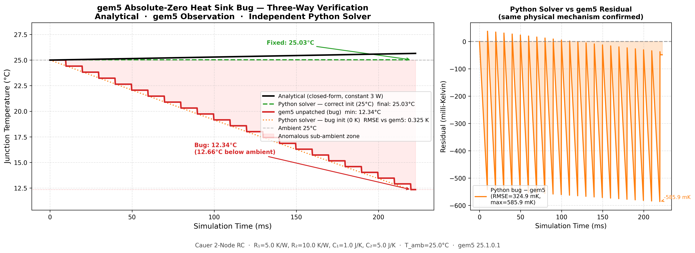

# ARM Thermal Research

本倉庫整理 ARM 與 gem5 熱模型研究的可重現 artifact，包含兩條相連的工作線：

1. Paper 1：檢查 gem5 原生 Cauer RC thermal path，揭露 `ThermalModel::startup()` 中間熱節點可能保留 0 K 初始狀態的 artifact。
2. Paper 2：加入 gem5 thermal-node instrumentation，並用 trace-driven co-simulation 評估 package-aware migration / DVFS 行為。

Paper 1 與 Paper 2 已於 2026-06-01 投稿至 IEEE Embedded Systems Letters，目前狀態是 under review。本倉庫是研究 artifact 與工程工作區，不代表論文已被接受。

## 重點

- Paper 1 的 bug report 顯示：若 gem5 的 intermediate thermal nodes 沒有被 domain 或 reference object 初始化，節點可能停在不合理的 0 K constructor state。
- Paper 1 使用五路驗證：closed-form analysis、獨立 Python Backward Euler solver、SPICE equivalent circuit、unpatched gem5、patched gem5。
- Paper 2 使用三節點 Cauer RC model 區分 die、package、heatsink inertia，並在 trace-driven workload 上評估先 migration、後 DVFS 的 package-aware policy。
- 倉庫保留 figures、scripts、patches、CSV/JSON evidence，方便 reviewer 或讀者追蹤每個 claim 的來源。



## 目錄導覽

- `paper_artifacts/INDEX.md`：paper-adjacent artifact 的公開索引。
- `paper_artifacts/paper1_latex_draft/`：Paper 1 投稿 source snapshot。
- `paper_artifacts/paper2_latex_draft/`：Paper 2 投稿 source snapshot。
- `validation/`：analytical、numerical、SPICE validation。
- `bug-reports/`：gem5 thermal-node initialization report 與 reproduction material。
- `results/`：figures、JSON summaries、curated run outputs。
- `scripts/`：run、parse、maintenance helpers。
- `workloads/`：benchmark / workload source。

投稿包、cover letter、portal reviewer PDF、remote-AI handoff、審稿風險筆記、未投稿後續研究規劃不放入公開 Git index。

## 快速開始

### 重現 gem5 bug

```bash
bash bug-reports/gem5-thermal-node-init/reproduce.sh
```

### 執行獨立 solver

```bash
pip install -r requirements.txt
python3 validation/implicit_solver/implicit_solver.py
```

### 執行 analytical solution

```bash
python3 validation/analytical/analytical_solution.py
```

### 執行 DVFS simulation

```bash
python3 scripts/thermal_governor.py --workload idct
python3 scripts/thermal_governor.py --workload brightness
```

## 主要結果

- Paper 1 validation：在 canonical 3.0 W step input 下，analytical、Python、SPICE fixed baselines 彼此差異小於 0.001 K。
- Paper 1 full-system patched gem5 run：Python replay 與 gem5 在 55.116 s trace 上的 RMSE 為 0.0082 K，peak error 為 0.034 K。
- Paper 2 trace-driven study：三節點模型相較二節點 baseline，將第一次 thermal intervention 延後 85 simulated seconds。
- Paper 2 package-aware policy：在 modeled 600 s sustained-load experiment 中，DVFS oscillation events 由 13 降為 1，modeled peak package temperature 降低 4.5 C。

本倉庫目前沒有硬體量測結果；所有定量結果應視為 modeled 或 simulated results。

## 延伸閱讀

- [Documentation index](docs/README.md)
- [Paper artifact workspace index](paper_artifacts/INDEX.md)
- [Operations scripts](scripts/ops/README.md)
- [Bug reports](bug-reports/README.md)
- [Validation](validation/README.md)
- [Results](results/README.md)
- [Public release checklist](PUBLIC_RELEASE_CHECKLIST.md)
- [Citation metadata](CITATION.cff)
