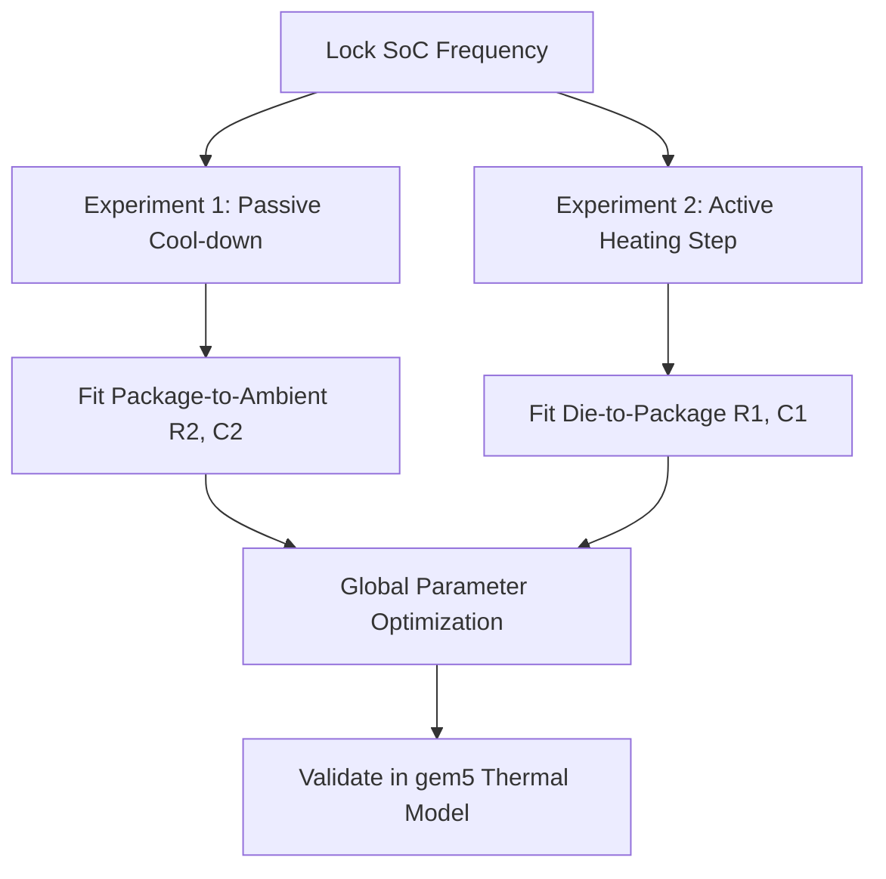

# Phase 7: Real-Device Thermal Calibration Guide

This guide outlines the methodology for calibrating the gem5 Cauer RC thermal network using empirical data collected from real ARM-based System-on-Chips (SoCs), such as the Rockchip RK3588 (4x Cortex-A76 + 4x Cortex-A55) or the Qualcomm Snapdragon 8 Gen 2.

Simulations are only as good as the parameters that govern them. By calibrating the thermal resistance ($R_{th}$) and thermal capacitance ($C_{th}$) values against real-world silicon, we bridge the gap between gem5 simulations and physical hardware.

---

## 1. Prerequisites and Hardware Setup

To perform high-fidelity calibration, you need root access to the target ARM development board running a Linux-based OS (Ubuntu, Debian, or Android with ADB root access).

### Target Platforms
- **Rockchip RK3588**: Popular in edge-computing nodes, features distinct CPU clusters (Big, Mid, Little), and exposed sysfs nodes for thermal sensors.
- **Qualcomm Snapdragon 8 Gen 2**: Common in high-end mobile devices and development kits, includes high-resolution On-Device Power Monitors (ODPM).

---

## 2. Sensor Exploration via sysfs

Linux kernels expose thermal and power configurations through the `/sys` filesystem. 

### A. Locating Thermal Sensors
First, inspect the available thermal zones to identify which physical component each zone represents:

```bash
for zone in /sys/class/thermal/thermal_zone*; do
    echo "$(basename $zone): $(cat $zone/type) -> $(cat $zone/temp) m°C"
done
```

On an RK3588, you will typically find:
- `thermal_zone0`: `soc-thermal` (general SoC temperature)
- `thermal_zone1`: `cpu-thermal` / `bigcpu0-thermal`
- `thermal_zone2`: `bigcpu1-thermal`
- `thermal_zone3`: `gpu-thermal`

*Note: Temperatures are reported in millidegrees Celsius (e.g., `45000` = 45°C).*

### B. Monitoring CPU Frequency and Voltage
To lock the system into specific thermal states, we must read (and control) the CPU frequency and voltage:

```bash
# Get scaling governor and current frequency
cat /sys/devices/system/cpu/cpufreq/policy0/scaling_governor
cat /sys/devices/system/cpu/cpufreq/policy0/scaling_cur_freq

# Lock governor to userspace to manually control frequency
echo "userspace" > /sys/devices/system/cpu/cpufreq/policy0/scaling_governor
echo "1800000" > /sys/devices/system/cpu/cpufreq/policy0/scaling_setspeed
```

---

## 3. Power Data Acquisition

Accurate thermal calibration requires knowing the exact power input ($P$) injected into the node.

### Option A: Internal Power Monitors (ODPM / Coulomb Counters)
On premium boards (e.g., Snapdragon 8 Gen 2), ODPM rails expose exact power consumption in micro-watts:
```bash
# Read specific power rails (e.g., CPU_BIG)
cat /sys/class/power_supply/battery/power_now  # Device-level power
# Or platform-specific debugfs paths
cat /sys/kernel/debug/energy_model/pmstat
```

### Option B: Software Profiling and Modeling (simpleperf)
If hardware monitors are unavailable, power must be modeled:
1. Lock frequency ($f$) and read the corresponding voltage ($V$) from the regulator:
   ```bash
   cat /sys/class/regulator/regulator.*/microvolts
   ```
2. Estimate dynamic power:
   $$P_{dyn} = C_{eff} \cdot V^2 \cdot f \cdot U$$
   where $C_{eff}$ is the effective switching capacitance and $U$ is CPU utilization (derived from `simpleperf` or `/proc/stat`).
3. Account for temperature-dependent leakage (static power):
   $$P_{stat} = I_{leak}(T) \cdot V = I_0 \cdot e^{k \cdot T} \cdot V$$

---

## 4. Empirical Calibration Workflow

Calibrating a 2-node or 3-node Cauer network requires decoupling the parameters. We achieve this by running two distinct physical experiments.



### Step 1: Passive Cool-down Transient (Decoupling $R_2$ and $C_2$)
The ambient-facing parameters govern the slow, macro thermal decay when no active power is being dissipated.
1. Run a heavy workload (e.g., `stress-ng --cpu 8`) to heat the chip to $\approx 75^\circ\text{C}$.
2. Stop the workload abruptly and immediately set the CPU governor to `powersave` (or hot-unplug 7 of 8 cores).
3. Sample `/sys/class/thermal/thermal_zone1/temp` at 10ms intervals for 180 seconds.
4. Since $P \approx 0$, the decay curve is dominated by the package-to-ambient time constant:
   $$\tau_2 = R_2 \cdot C_2$$
   Fit this exponential decay using Scipy:
   ```python
   # Simple RC decay fitting: T(t) = T_amb + (T_start - T_amb) * exp(-t / tau)
   ```

### Step 2: Active Heating Step Response (Fitting $R_1$ and $C_1$)
The die-level parameters govern the rapid, short-term temperature spike upon load onset.
1. Allow the SoC to reach absolute steady-state idle at ambient temperature ($T_0 = T_{amb} \approx 25^\circ\text{C}$).
2. Trigger a deterministic workload (e.g., a fixed-size `dhrystone` loop) locked to a high frequency cluster.
3. Record the fast transient temperature rise at a high sample rate.
4. The initial sharp rise ($0 \to 2\text{ seconds}$) is dominated by the die-level time constant:
   $$\tau_1 = R_1 \cdot C_1$$
   while the long-term saturation ($5 \to 60\text{ seconds}$) is governed by the package and ambient resistance.

---

## 5. Mathematical Fitting & Optimization

Once the data $(t_i, T_{measured, i})$ is recorded, we solve the optimization problem using a Python script.

### 2-Node Cauer RC State-Space Equations
The system state is represented by $\mathbf{x} = [T_{die}, T_{pkg}]^T$. The continuous-time state-space representation is:

$$\frac{d\mathbf{x}}{dt} = \mathbf{A}\mathbf{x} + \mathbf{B}u$$

$$\mathbf{A} = \begin{bmatrix} -\frac{1}{R_1 C_1} & \frac{1}{R_1 C_1} \\ \frac{1}{R_1 C_2} & -(\frac{1}{R_1 C_2} + \frac{1}{R_2 C_2}) \end{bmatrix}, \quad \mathbf{B} = \begin{bmatrix} \frac{1}{C_1} \\ 0 \end{bmatrix}, \quad u = P_{in}(t)$$

### Optimization Script (`calibrate_rc.py`)
Save this utility script to automate parameter extraction:

```python
import numpy as np
from scipy.optimize import minimize
from scipy.integrate import solve_ivp

# Experimental inputs
t_data = np.array([...])        # Timestamps (seconds)
T_data = np.array([...])        # Measured Die Temperature (°C)
P_data = np.array([...])        # Measured Power Profile (W)
T_amb = 25.0

def simulate_cauer(params, t, P):
    R1, R2, C1, C2 = params
    
    # State derivative
    def ODE(time, x):
        T_die, T_pkg = x
        P_t = np.interp(time, t, P)
        dT_die = (P_t - (T_die - T_pkg)/R1) / C1
        dT_pkg = (((T_die - T_pkg)/R1) - (T_pkg - T_amb)/R2) / C2
        return [dT_die, dT_pkg]
    
    sol = solve_ivp(ODE, [t[0], t[-1]], [T_data[0], T_data[0]], t_eval=t, method='RK45')
    return sol.y[0] # Returns T_die history

def loss_function(params):
    # Enforce physical constraints: all resistances and capacitances must be positive
    if np.any(params <= 0):
        return 1e9
    T_sim = simulate_cauer(params, t_data, P_data)
    return np.mean((T_sim - T_data) ** 2) # Mean Squared Error

# Initial guess: R1=5 K/W, R2=10 K/W, C1=1 J/K, C2=5 J/K
initial_guess = [5.0, 10.0, 1.0, 5.0]
res = minimize(loss_function, initial_guess, method='Nelder-Mead')
print("Optimized Parameters:")
print(f"R1: {res.x[0]:.4f} K/W, R2: {res.x[1]:.4f} K/W")
print(f"C1: {res.x[2]:.4f} J/K,  C2: {res.x[3]:.4f} J/K")
```

---

## 6. Porting to gem5

Once the physical parameters are extracted, integrate them back into your gem5 full-system configuration.

In your gem5 configuration file (e.g., `configs/common/ThermalModel.py` or equivalent python setup script):

```python
# Instantiate a Cauer Thermal Model in gem5
thermal_model = CauerThermalModel()

# Register the calculated physical properties
thermal_model.R_die_pkg = 4.821  # R1 (K/W)
thermal_model.R_pkg_amb = 9.742  # R2 (K/W)
thermal_model.C_die     = 0.985  # C1 (J/K)
thermal_model.C_pkg     = 4.891  # C2 (J/K)

# Apply to CPU thermal domains
for cpu in system.cpu:
    cpu.thermal_domain.model = thermal_model
```

By applying these steps, the gem5 timing simulation will reflect the thermal dynamics of your specific hardware silicon, enabling highly reliable closed-loop governor research.
