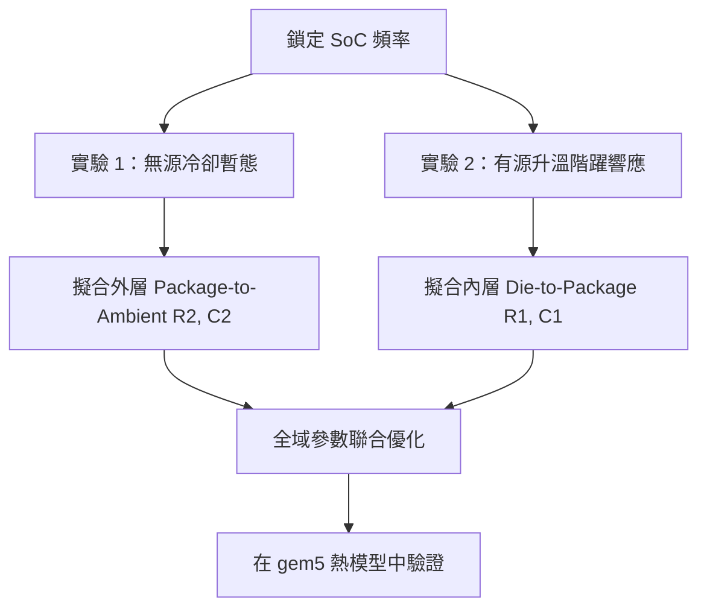

# Phase 7: 真實硬體溫度校準指南 (Real-Device Thermal Calibration Guide)

本指南旨在說明如何利用在真實 ARM 架構系統單晶片（SoC，例如 Rockchip RK3588 或 Qualcomm Snapdragon 8 Gen 2 開發板）上收集的實驗數據，來校準 gem5 Cauer RC 熱力網路模型。

模擬的精準度取決於控制它的物理參數。藉由對比真實晶圓的物理數據，校準熱阻（$R_{th}$）與熱容（$C_{th}$），我們能夠填補 gem5 虛擬仿真與真實硬體之間的物理鴻溝。

---

## 1. 準備工作與硬體設定

若要進行高保真度的熱校準，您需要具備目標 ARM 開發板的 root 權限，且該板需運行 Linux 系統（如 Ubuntu、Debian）或開啟 ADB root 權限的 Android 系統。

### 目標平台
- **Rockchip RK3588**：廣泛應用於邊緣運算節點，擁有異質的 CPU 叢集（Big、Mid、Little）以及直接暴露在 sysfs 的溫度感測器節點。
- **Qualcomm Snapdragon 8 Gen 2**：高階行動裝置與開發套件，具備高精度的晶片級功耗監控器（ODPM）。

---

## 2. 透過 sysfs 探索感測器

Linux 核心藉由 `/sys` 虛擬檔案系統向用戶空間暴露溫度與功耗設定。

### A. 定位熱感測器 (Thermal Zones)
首先，檢查所有可用的 thermal zones，確認每個節點對應的物理組件：

```bash
for zone in /sys/class/thermal/thermal_zone*; do
    echo "$(basename $zone): $(cat $zone/type) -> $(cat $zone/temp) m°C"
done
```

在 RK3588 平台上，通常會發現：
- `thermal_zone0`: `soc-thermal` (SoC 整體溫度)
- `thermal_zone1`: `cpu-thermal` 或 `bigcpu0-thermal`
- `thermal_zone2`: `bigcpu1-thermal`
- `thermal_zone3`: `gpu-thermal`

*注意：溫度值以毫攝氏度為單位表示（例如 `45000` 代表 45°C）。*

### B. 監控與控制 CPU 頻率與電壓
為了讓系統處於受控的熱狀態，我們需要讀取並鎖定 CPU 的工作頻率：

```bash
# 獲取當前的 governor 與運作頻率
cat /sys/devices/system/cpu/cpufreq/policy0/scaling_governor
cat /sys/devices/system/cpu/cpufreq/policy0/scaling_cur_freq

# 將 governor 鎖定在 userspace 以便手動指定頻率
echo "userspace" > /sys/devices/system/cpu/cpufreq/policy0/scaling_governor
echo "1800000" > /sys/devices/system/cpu/cpufreq/policy0/scaling_setspeed
```

---

## 3. 功耗數據採集

準確的熱校準需要知道注入至節點的確切功率（$P$）。

### 方案 A：硬體功耗監控器 (ODPM / Coulomb Counter)
在高端開發板上（例如 Snapdragon 8 Gen 2），ODPM 軌道會暴露微瓦級的精確功耗：
```bash
# 讀取特定功耗軌（例如 CPU_BIG）
cat /sys/class/power_supply/battery/power_now  # 裝置整體功耗
# 或特定平台的 debugfs 路徑
cat /sys/kernel/debug/energy_model/pmstat
```

### 方案 B：軟體分析與數學估算 (simpleperf)
若硬體功耗儀不可用，則必須使用功耗模型進行估算：
1. 鎖定頻率（$f$）並讀取調節器（regulator）對應的電壓（$V$）：
   ```bash
   cat /sys/class/regulator/regulator.*/microvolts
   ```
2. 估算動態功耗：
   $$P_{dyn} = C_{eff} \cdot V^2 \cdot f \cdot U$$
   其中 $C_{eff}$ 為等效開關電容，$U$ 為 CPU 使用率（可透過 `simpleperf` 或 `/proc/stat` 獲得）。
3. 考慮與溫度相關的漏電流（靜態功耗）：
   $$P_{stat} = I_{leak}(T) \cdot V = I_0 \cdot e^{k \cdot T} \cdot V$$

---

## 4. 實證校準工作流程

要校準一個 2 節點或 3 節點的 Cauer 網路，必須將參數解耦。我們透過設計兩個獨立的物理實驗來達成此目的。



### 步驟 1：無源冷卻暫態實驗 (解耦 $R_2$ 與 $C_2$)
外層（面向環境）的參數決定了無源冷卻時，系統緩慢的巨觀熱衰減行為。此時功耗接近於零。
1. 執行重負載（如 `stress-ng --cpu 8`），將晶片加熱至約 $75^\circ\text{C}$。
2. 突然終止負載，並立即將 CPU governor 設為 `powersave`（或將 8 個核心關閉 7 個）。
3. 以 10 毫秒的間隔採樣 `/sys/class/thermal/thermal_zone1/temp`，持續 180 秒。
4. 由於 $P \approx 0$，此時的降溫曲線完全受控於封裝到環境的時間常數：
   $$\tau_2 = R_2 \cdot C_2$$
   使用 Scipy 擬合此指數衰減：
   ```python
   # 簡單的 RC 降溫擬合: T(t) = T_amb + (T_start - T_amb) * exp(-t / tau)
   ```

### 步驟 2：有源升溫階躍響應實驗 (擬合 $R_1$ 與 $C_1$)
內層（die級別）的參數決定了在負載瞬間突入時，溫度的快速上升區段。
1. 讓 SoC 靜置至完全達到環境溫度的穩態（$T_0 = T_{amb} \approx 25^\circ\text{C}$）。
2. 在特定核心上觸發一個確定性的恆定工作負載（例如鎖定最高頻率運行 `dhrystone` 迴圈）。
3. 以高頻率採樣並記錄溫度的快速暫態上升過程。
4. 初始的前幾秒（$0 \to 2\text{ 秒}$）陡峭上升曲線完全由 die 級別的時間常數決定：
   $$\tau_1 = R_1 \cdot C_1$$
   而長期的飽和區段（$5 \to 60\text{ 秒}$）則由封裝和環境熱阻控制。

---

## 5. 數學擬合與參數優化

記錄實驗數據 $(t_i, T_{measured, i})$ 後，我們可以使用 Python 腳本來求解這個優化問題。

### 2 節點 Cauer RC 狀態空間方程
系統狀態表示為 $\mathbf{x} = [T_{die}, T_{pkg}]^T$。連續時間的狀態空間方程為：

$$\frac{d\mathbf{x}}{dt} = \mathbf{A}\mathbf{x} + \mathbf{B}u$$

$$\mathbf{A} = \begin{bmatrix} -\frac{1}{R_1 C_1} & \frac{1}{R_1 C_1} \\ \frac{1}{R_1 C_2} & -(\frac{1}{R_1 C_2} + \frac{1}{R_2 C_2}) \end{bmatrix}, \quad \mathbf{B} = \begin{bmatrix} \frac{1}{C_1} \\ 0 \end{bmatrix}, \quad u = P_{in}(t)$$

### 參數提取優化腳本 (`calibrate_rc.py`)
以下 Python 腳本用於自動擬合並提取熱阻與熱容：

```python
import numpy as np
from scipy.optimize import minimize
from scipy.integrate import solve_ivp

# 實驗量測數據
t_data = np.array([...])        # 時間戳記 (秒)
T_data = np.array([...])        # 實測 Die 溫度 (°C)
P_data = np.array([...])        # 實測功耗序列 (W)
T_amb = 25.0

def simulate_cauer(params, t, P):
    R1, R2, C1, C2 = params
    
    # 狀態導數方程
    def ODE(time, x):
        T_die, T_pkg = x
        P_t = np.interp(time, t, P)
        dT_die = (P_t - (T_die - T_pkg)/R1) / C1
        dT_pkg = (((T_die - T_pkg)/R1) - (T_pkg - T_amb)/R2) / C2
        return [dT_die, dT_pkg]
    
    sol = solve_ivp(ODE, [t[0], t[-1]], [T_data[0], T_data[0]], t_eval=t, method='RK45')
    return sol.y[0] # 返回 T_die 模擬歷史

def loss_function(params):
    # 物理約束限制：所有熱阻與熱容必須為正值值
    if np.any(params <= 0):
        return 1e9
    T_sim = simulate_cauer(params, t_data, P_data)
    return np.mean((T_sim - T_data) ** 2) # 均方誤差 (MSE)

# 初始估計值：R1=5 K/W, R2=10 K/W, C1=1 J/K, C2=5 J/K
initial_guess = [5.0, 10.0, 1.0, 5.0]
res = minimize(loss_function, initial_guess, method='Nelder-Mead')
print("優化擬合後的熱參數結果：")
print(f"R1: {res.x[0]:.4f} K/W, R2: {res.x[1]:.4f} K/W")
print(f"C1: {res.x[2]:.4f} J/K,  C2: {res.x[3]:.4f} J/K")
```

---

## 6. 在 gem5 中套用校准參數

一旦成功提取物理參數，即可將其寫入 gem5 全系統模擬的 Python 配置檔案中。

在您的 gem5 設定檔（例如 `configs/common/ThermalModel.py` 或等效的 Python 腳本）：

```python
# 在 gem5 中實例化 Cauer 熱模型
thermal_model = CauerThermalModel()

# 註冊我們剛才從真實開發板上校正得出的物理屬性值
thermal_model.R_die_pkg = 4.821  # R1 (K/W)
thermal_model.R_pkg_amb = 9.742  # R2 (K/W)
thermal_model.C_die     = 0.985  # C1 (J/K)
thermal_model.C_pkg     = 4.891  # C2 (J/K)

# 將熱模型套用至 CPU 的 thermal domains
for cpu in system.cpu:
    cpu.thermal_domain.model = thermal_model
```

套用這些精確的熱物理數值後，gem5 時序模擬將能極致逼真地反映您實體 ARM 開發晶片的工作溫度動態，為後續的閉環熱管理調度算法（DVFS Governor）提供精確的研發驗證基礎。
